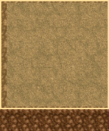
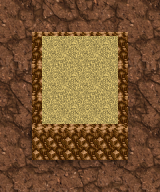
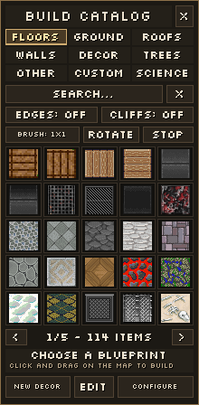
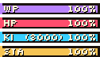
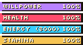

# Native build and HUD review

These PNGs are composed from the actual icon objects created by the headless BYOND smoke fixtures. They are **not in-game screenshots** and do not verify Dream Seeker's screen compositing, display scaling or mouse input.

- `BuildPanelTextSmoke.png`: the 220x448 catalog, including its live catalog thumbnails, frames and glyph labels; one animation frame is exported.
- `VitalsTextSmoke50.png`, `75`, `100`, `125`, `150`: the actual four bar icons and their label/value glyph icons at each tested scale. Rows are placed in a review strip with four pixels between them; this is not the complete character/vitals panel.
- `BuildBrush5x5Smoke.png`: the complete outlined 5x5 brush with its planned southern cliff row, composited from runtime preview images over the test terrain. The extra sixth row shows the cliff finishing outside the painted footprint.
- `BuildTerrainFinishingSmoke.png`: a committed 3x3 patch with perimeter edges and three owned cliff tiles on natural land. The fixture runs with global world decoration disabled.

View at native size or an integer zoom with nearest-neighbor sampling. The glyph renderer selects 8/12/16px source glyphs and never resizes a finished text line. The game may still apply the user's map/display scaling.

Regenerate with `tools/Invoke-ByondSmoke.ps1 -KeepTemp`. Review images are written into the temporary `world` and `world/.smoke-clean` directories; copy the named PNGs here after a passing run. The text investigation and verification results are in [BuildHudRenderingResearch.md](../../docs/BuildHudRenderingResearch.md). The terrain/brush behavior follows the user's `2026-09-11 08-04-55.mp4` reference; current behavior and regression coverage are documented in [building.md](../../docs/procs/building.md).

The terrain previews were refreshed on 2026-09-11 after the versioned-data and clean-data smoke assertions passed with BYOND 516.1686. Coverage includes same-material raised patches, nested terraces, saved elevations, perimeter-only cliffs, construction costs and inactive-control hover state.

5x5 brush preview, including the planned cliff row:

Committed 3x3 terrain patch:

75% vitals:

100% vitals:

