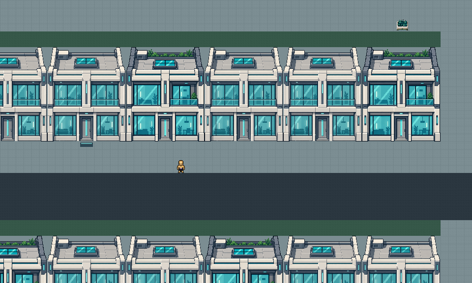

# Ecumenópolis de Viltrum — 2026-09-14

Viltrum Z20 foi reconstruída com 58 quadras e 877 edifícios. A arquitetura usa
casas modernas contíguas de 5×6 tiles, hospitais/bibliotecas/terminais de 7×6 e
sete marcos cívicos de 8×10. O kit é original; os antigos sprites de torres não
foram reaproveitados. São seis edifícios, 266 recortes estruturais de 32×32 e
30 estados de ruas/pavimentos/entradas, com fontes Aseprite editáveis.



## Composição

| Bairro | Quadras | Papel |
| --- | ---: | --- |
| Porto Meridional | 11 | Terminais e habitação junto da chegada preservada |
| Bairros do Poente | 14 | Frentes residenciais, clínica e pátios locais |
| Coroa Imperial | 9 | Administração, praça e ligação ao arquivo existente |
| Terraços Boreais | 11 | Habitação compacta e jardins planejados |
| Distrito de Ciências | 13 | Bibliotecas, pesquisa e habitação oriental |

As quadras principais têm 44×44 tiles; seis quadras menores de 32×32 preenchem
o sudeste e as sobras perto da costa. Avenidas de cinco tiles e vias locais de
três formam uma rede conectada. Cada trecho de expansão liga um circuito urbano
à rede anterior, com corredor seco e livre verificado antes da construção.
Há dois tiles livres na frente de cada fachada. Jardins e praças preservam
espaço de circulação e combate; não foram criados atravessamentos do oceano.

Ver [panorama](ViltrumEcumenopolisPreview/PlanetOverview.png),
[atlas de 25 chunks](ViltrumEcumenopolisPreview/ChunkAtlas.png),
[hospital](ViltrumEcumenopolisPreview/HospitalStreet.png) e
[pátio imperial](ViltrumEcumenopolisPreview/ImperialCourt.png).

## Jogabilidade e preservação

- Os 37 prédios acessíveis de Viltrum têm soleira marcada: caminhar sobre ela
  entra no interior separado, em Z22. O único portal da sala retorna ao passeio
  do mesmo prédio, em Z20. Também continuam disponíveis clique e verbo de entrada.
- IDs, salas, pisos, áreas e pontos internos foram preservados. Os nomes de salas
  do registro anterior permanecem para compatibilidade; as coordenadas exteriores
  agora pertencem à nova cidade. Os demais edifícios compõem fachadas fechadas.
- Os 66 interiores de prédios continuam vazios, com exatamente um retorno cada;
  a caverna e os 29 prédios da Terra foram preservados.
- A arte estrutural de cada tile coincide com o recorte do edifício. A colisão
  e opacidade pertencem aos turfs, conforme a convenção de roofs, e continuam
  funcionando quando a âncora do objeto está fora da visão.
- Foram preservados 57.135 tiles de água, a faixa limite, o spawn 250,250,
  a chegada 250,78 e a dispersão segura, todas as correções manuais recuperadas
  e o conjunto do arquivo. Áreas de combate receberam apenas solo/circulação
  livre onde necessário. Mobiliário conserva alfa e colisão independente.
- `area/Viltrum` desativa `auto_cliffs`, `auto_edges` e `auto_waves`. As políticas
  são verificadas pelas rotinas existentes, inclusive quando chamadas diretamente.
  Sombras legítimas e animações autoradas permanecem disponíveis.
- SuperEarth.dmm e seu metadata conservaram seus hashes exatos. Nenhum gerador
  terrestre foi executado. A ordem dos cinco mapas em DU.dme foi preservada.

Para a revisão no jogo, alguns destinos úteis são a residência em (125,358,20),
a clínica em (116,334,20) e a entrada imperial em (305,352,20).
O binário local precisa ser iniciado/reiniciado para carregar o novo mapa.

## Fonte e reprodução

`tools/MapAssembly/AuthorViltrumEcumenopolis.cjs` é o autor desta revisão.
Sem argumentos, gera e testa um candidato em `.codex-tmp/ViltrumEcumenopolis`.
`--apply` compara novamente todos os hashes antes da escrita, retém o backup,
escreve os 25 chunks, monta Viltrum e atualiza somente os retornos correspondentes.
Não existe opção de forçar ou descartar edições manuais.

O mapa inicial tinha diferença de serialização em relação ao metadata, mas
**zero diferenças semânticas nos 250.000 tiles** em relação aos chunks. Essa
comparação foi feita antes da normalização. O backup imutável dessa entrada está
em `RebuildBaseline/BeforeViltrumEcumenopolis/`, com os arquivos originais, chunks,
registro, interiores e hashes. Os arquivos terrestres nesse backup são evidência
de preservação, não instrução para sobrescrever uma Terra editada posteriormente.

Após qualquer edição manual posterior, o autor recusa reaplicação. Integre a
edição deliberadamente aos insumos atuais; não restaure uma fase antiga. Os
autores Slice/Capital/Wilderness e suas especificações são históricos.

Para editar arte, use `ArtSource/Viltrum/Ecumenopolis/*.aseprite` e exporte:

```powershell
python tools/MapAssembly/ExportViltrumEcumenopolis.py --aseprite "C:/Program Files (x86)/Steam/steamapps/common/Aseprite/Aseprite.exe"
python tools/MapAssembly/AuditViltrumEcumenopolis.py
node tools/MapAssembly/AuthorViltrumEcumenopolis.cjs
python tools/MapAssembly/RenderViltrumEcumenopolis.py
```

`--initialize` importa apenas fontes nativas que ainda não existem. As imagens
geradas originais e prompts estão em `ArtSource/Viltrum/Ecumenopolis/Generated`
e `Generation.json`. O PNG opaco da biblioteca foi rejeitado e corrigido com
imagegen; ele fica retido apenas como proveniência. Não há remoção por chroma key.

## Verificações

**Resultado de 2026-09-14:** compilação BYOND 516.1686 com zero erros/warnings;
smoke completo passou nos modos Versioned e Clean, sem runtimes. O DU.dmb/DU.rsc
local também foi recompilado. Auditoria de assets: 3.740 referências, nenhuma
pendência. Dez testes da pipeline e ordem dos mapas passaram. O registro detalhado
está em [ViltrumEcumenopolisValidation.json](ViltrumEcumenopolisValidation.json).
A auditoria informativa de nomes ainda identifica 6.177 pendências no repositório
legado; os dois novos arquivos DM não apresentam violações.

```powershell
node tools/MapAssembly/TestViltrumEcumenopolis.cjs
node tools/MapAssembly/CityBuildingChecks.cjs
node tools/MapAssembly/TestPlanetChunks.cjs Viltrum
node tools/MapAssembly/TestRuntimeMapOrder.cjs
.\tools\Test-AssetReferences.ps1 -Strict
.\tools\Invoke-ByondSmoke.ps1 -StartupTimeoutSeconds 300
```

O teste da cidade lê os arquivos aplicados, sem depender do staging ignorado.
Confere fachadas/colisão/arte, água, edições protegidas, interiores e conectividade:
42.985 tiles de vias pertencem à mesma rede, e todas as fachadas são alcançáveis
a partir da chegada. O relatório fica em `ViltrumEcumenopolisChecks.json`.

O smoke exercita as 37 portas mapeadas com movimento real, retorno, KO/KB,
rejeição de planeta/sala incorretos e contexto planetário; verifica 26.864 turfs
estruturais e a proteção contra caminhada, voo e knockback. Depois compara todos
os 250.000 tiles de Viltrum antes/depois de edges/waves, 727 margens e 16 zonas
de geração tardia. A cobertura existente da Terra também permanece ativa.

Previews são composições offline dos DMI finais, com personagem em escala nativa.
Não representam iluminação ou visibilidade final do cliente. A aprovação visual
e interativa em BYOND cabe ao usuário; StrongDMM e as interfaces BYOND não foram
abertas para inspeção.
